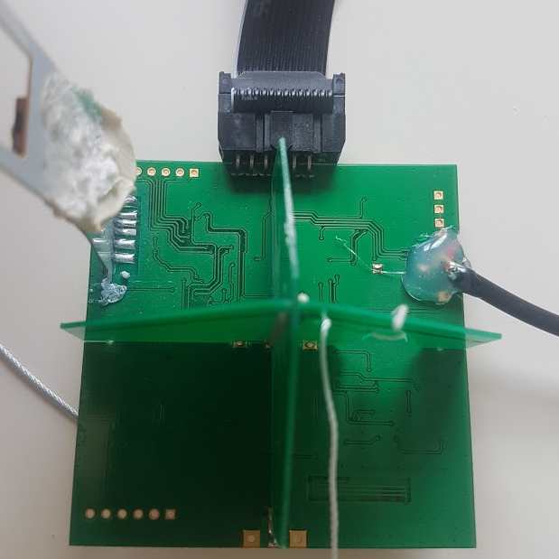
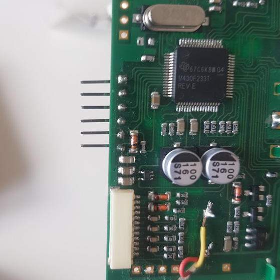
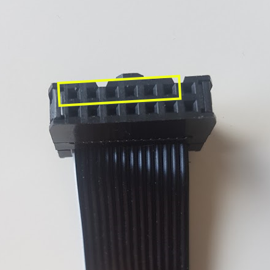

# m10-aprs

C++ code to have fun with M10 radio sonde (version with GTop GPS, if other GPS code must be adapted).

Code is messy and have been 'hacked together' in a hurry but it contains almost reusable modules :
- APRS : converts an ascii APRS packet into a raw packet (that can be sent over the air)
- RadioAdf7012 : handle transmitter operation, sets the registers correctly for M10 use and FSK modulation
- M10Configuration : helper functions to setup basic microcontroller operation

To compile :
- Download Code Composer Studio from TI, this is a free IDE.
- Create a project for MSP430F233 and add the source from this repository
- Compile code from this IDE

To Flash :
- Use TI MSP Fet Flash tool (other JTAG programmer may work)
- Connect to board as pictures (you will have to solder pin headers on the board)

